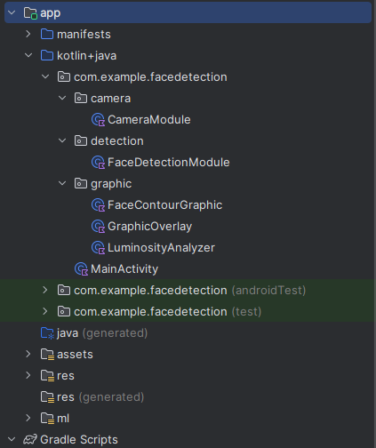

# Face Detection App

This project is an Android application that performs real-time face detection using the device's camera. The app utilizes the CameraX library for camera operations and TensorFlow Lite for running a pre-trained SSD MobileNet model to detect faces.

## Features

- Real-time face detection using CameraX and TensorFlow Lite.
- Overlay of detected faces on the camera preview.
- Capture button to take photos with detected faces highlighted.
- Store captured images to the device local storage
- Simple and clean architecture with dependency injection.

## Video

https://github.com/Abdelmohaymn/face_detection/assets/68782059/af5a18a4-8a7d-49d9-bc1b-deca25abe362


## Installation

1. Clone the repository:
    ```bash
    git clone https://github.com/Abdelmohaymn/face_detection.git
    ```

2. Open the project in Android Studio.

3. Build the project and run it on an Android device.

## Usage

1. Launch the app. The camera preview will start automatically.
2. Grant camera permissions if prompted.
3. Faces detected by the model will be highlighted with a bounding box overlay.
4. Press the capture button to take a photo. The photo will be saved to the device storage.

## Dependencies

- CameraX
- TensorFlow Lite

## Project Structure



## How It Works

1. **Camera Setup**: The app uses CameraX to set up the camera and start the camera preview.
2. **Face Detection**: An `ImageAnalysis` analyzer processes each frame from the camera. The frames are passed to a TensorFlow Lite model (`SsdMobilenetV11Metadata1`) for face detection.
3. **Overlay**: Detected faces are highlighted with a bounding box drawn on a `GraphicOverlay` view.


